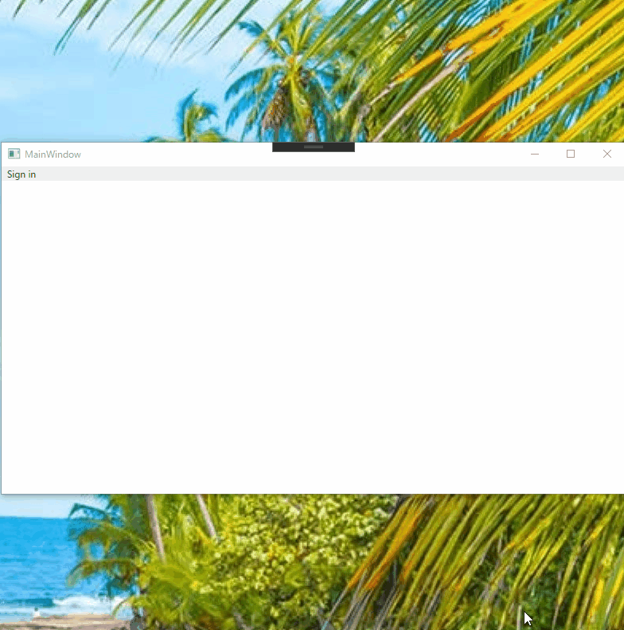

# Embedded Web UI for MSAL.NET for WPF on .NET Core

This provides embedded web browser interface for WPF on .NET Core when using MSAL.NET.
The objective for this repo is to provide a sample code how to create custom web ui on MSAL.NET.
If you would like to just use this sample code, you can get a nuget package from:
https://www.nuget.org/packages/EmbeddedMsalCustomWebUi.Wpf/

## How to use it?

It's easy to use, you can use this just set `EmbeddedMsalCustomWebUi.Wpf.EmbeddedBrowserWebUi` with `WithCustomWebUi` of MSAL.NET extension method.

```csharp
IPublicClientApplication app = ...;
var result = await app.AcquireTokenInteractive(new[] { "your scope" })
  .WithCustomWebUi(new EmbeddedMsalCustomWebUi.Wpf.EmbeddedBrowserWebUi(ownerWindowInstance))
  .ExecuteAsync();
```

Needs a Window class instance for owner of the custom web ui window to create the EmbeddedBrowserWebUi instance.
And there are a few additional constructor arguments:

- title: The window title. The default value is "Sign in".
- windowWidth: The window width. The default value is 800.
- windowHeight: The window height. The default value is 650.
- windowStartupLocation: Thw window startup location. The default value is CenterOwner.

## How does it work


